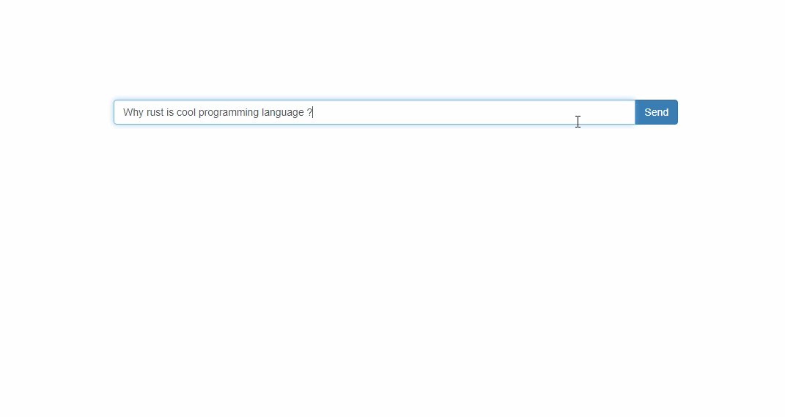

# `llm`-ui - Large Language Models Web interface

Simple web ui for [llm](https://github.com/rustformers/llm) library.



## Run application

Download selected model from:
https://huggingface.co/rustformers


```
git clone https://github.com/qooba/llm-ui
cd llm-ui
curl -LO https://huggingface.co/rustformers/gpt4all-j-ggml/resolve/main/gpt4all-j-q4_0-ggjt.bin
cargo run --release -- --host 0.0.0.0 --port 8089 gptj ./gpt4all-j-q4_0-ggjt.bin
```

Open: http://localhost:8089/index.html
